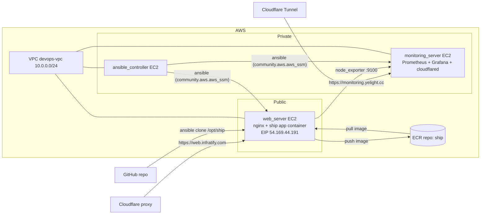

# DevOps Bootcamp Final Project 2026

Projek DevOps hujung-ke-hujung yang menyediakan **laman mikro Three.js kapal boleh suai** di AWS
serta memantaunya — menggunakan Terraform sebagai infrastruktur-sebagai-kod, Ansible untuk pengurusan
konfigurasi dan deployment, serta workflow GitHub Actions yang menerbitkan halaman ini ke GitHub Pages.

## Gambaran Keseluruhan

Pipeline ini mengambil aplikasi Vite + Three.js yang kecil (`app/`), membungkusnya dalam imej Docker,
menghantarnya ke repositori Amazon ECR yang peribadi, dan menjalankannya pada instans EC2 di belakang
nginx. Stack pemantauan berasingan (Prometheus + Grafana) mengutip metrik daripada pelayan aplikasi
melalui kontena `node_exporter`.

Segala-galanya di-bootstrap dan di-deploy melalui **AWS Systems Manager (SSM)** — tiada kunci SSH atau
port awam diperlukan untuk pengurusan. Dashboard Grafana didedahkan melalui **Cloudflare Tunnel**
(tiada IP awam atau port terbuka pada pelayan pemantauan), manakala aplikasi web boleh dicapai melalui
Elastic IP dengan proksi Cloudflare yang pilihan.

## Seni Bina



### Komponen

- **`terraform/`** — Infrastruktur sebagai Kod dengan provider AWS `~> 6.0`:
  - VPC dengan subnet awam/peribadi, NAT gateway, dan EIP untuk web server (`terraform-aws-modules/vpc/aws`).
  - `web_server` (awam, t3.micro), `ansible_controller` (peribadi), `monitoring_server` (peribadi).
  - Dua Elastic IP: satu untuk web server (`web-server-eip`) dan satu untuk NAT gateway.
  - Security groups: HTTP (80) terbuka ke internet, SSH/pengurusan dihadkan kepada CIDR VPC.
  - Repositori ECR `ship` dengan scan-on-push, serta IAM policy yang hanya merangkumi repo tersebut.
  - Keadaan jauh (state) disimpan dalam bucket S3 dengan locking (`use_lockfile`).
- **`ansible/`** — Pengurusan konfigurasi & deployment:
  - Bersambung melalui plugin sambungan **AWS SSM** (`community.aws.aws_ssm`), menggunakan inventor
    dinamik AWS EC2 yang ditapis oleh tag `Role: devops-node`.
  - `playbooks/site.yaml` → peranan `ship-app`: menjana Dockerfile/nginx/docker-compose daripada
    templat Jinja2, membina imej, menghantarnya ke ECR, dan menjalankan kontena dengan `docker compose`.
  - `playbooks/monitoring.yaml` → Prometheus + Grafana + **Cloudflare Tunnel** pada pelayan pemantauan
    dan `node_exporter` pada web server (mengutip pada port 9100). Token tunnel disimpan dalam bentuk
    disulitkan di `ansible/group_vars/all/secrets.yaml` (Ansible Vault) dan dijana ke dalam fail `.env`
    yang digunakan oleh `docker compose`.
  - `terraform/userdata/ansible-controller.sh` mem-bootstrap controller: memasang ansible, plugin SSM
    session manager, koleksi/peranan galaxy, dan konfigurasi inventor dinamik.
- **`app/`** — Laman mikro kapal:
  - Aplikasi Vite + Three.js; boleh disuai melalui `ship.config.json` (nama, warna, model kapal, lambang).
  - `npm test` menjalankan pintu pra-penerbangan yang menghenti proses jika konfig tidak sah;
    `npm run build` menghasilkan tapak statik ke `dist/`.

## Stack

| Lapisan      | Teknologi                                                         |
| ------------ | ---------------------------------------------------------------- |
| Infra        | Terraform, AWS VPC, EC2 (t3.micro x3), ECR, EIP x2, IAM, S3 state|
| Config/deploy| Ansible, AWS SSM (Session Manager), Ansible Vault, Docker, nginx  |
| Aplikasi     | Node 20, Vite, Three.js                                          |
| Pemantauan   | Prometheus, Grafana, node_exporter, Cloudflare Tunnel            |
| CI/CD        | GitHub Actions (GitHub Pages)                                    |

## Struktur Projek

```
.
├── app/               # Laman mikro Vite + Three.js kapal
├── ansible/           # Playbooks, peranan & inventor dinamik
│   ├── group_vars/all/secrets.yaml  # Token Cloudflare tunnel disulitkan (Vault)
│   └── playbooks/
│       ├── site.yaml       # Docker + ship app pada web_server
│       └── monitoring.yaml # Prometheus/Grafana + cloudflared + node_exporter
├── terraform/         # Infrastruktur AWS (VPC, EC2, ECR, SG, IAM)
│   └── userdata/ansible-controller.sh
└── .github/workflows/ # Menerbitkan readme ini ke GitHub Pages
```

## Memulakan

### Aplikasi (pembangunan tempatan)

```bash
cd app
npm install
npm test        # pintu pra-penerbangan: berhenti jika ship.config.json tidak sah
npm run dev     # pratonton langsung
npm run build   # tapak statik → dist/
npm run preview # menghidangkan build pada :8080
```

Suai kapal anda dengan menyunting `app/ship.config.json`.

### Infrastruktur

```bash
cd terraform
terraform init
terraform plan -var-file terraform.tfvars
terraform apply -var-file terraform.tfvars
```

### Deployment

Dari `ansible_controller`, jalankan playbooks (mereka bersambung ke nod melalui SSM). Playbook
pemantauan memuatkan token Cloudflare tunnel yang disulitkan, jadi ia memerlukan kata laluan Vault:

```bash
ansible-playbook playbooks/site.yaml -e "aws_region=ap-southeast-1"
ansible-playbook playbooks/monitoring.yaml --ask-vault-pass
```

## Pemantauan

- **Prometheus** mengutip web server setiap 15 saat melalui `node_exporter` (`:9100`).
- **Grafana** (port 3000) memaparkan metrik pada pelayan pemantauan.
- **Cloudflare Tunnel** mendedahkan Grafana di `https://monitoring.yelight.cc` — tanpa membuka port
  masuk pada pelayan pemantauan peribadi; tunnel bersambung keluar ke edge Cloudflare.
- Dashboard Grafana **Node Exporter Full** (ID `1860`) memaparkan CPU, memori dan cakera web server.

## GitHub Pages

`readme.md` di peringkat akar diterbitkan ke tapak GitHub Pages awam oleh workflow dalam
`.github/workflows/pages.yaml` — tolakan ke `main` menjadikan markdown kepada HTML dengan `pandoc`
(dengan rajah Mermaid), dan men-deploy-nya dengan tindakan rasmi `actions/deploy-pages`.