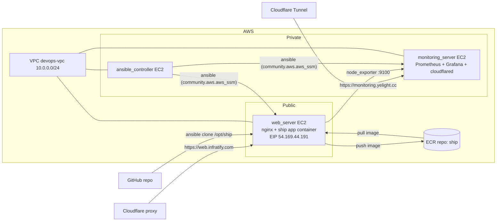

# DevOps Bootcamp Final Project 2026

An end-to-end DevOps project that provisions a **customisable Three.js ship microsite** on AWS and
monitors it — using Terraform for infrastructure as code, Ansible for configuration management and
deployment, and a GitHub Actions workflow that publishes this page to GitHub Pages.

## Overview

The pipeline takes a tiny Vite + Three.js app (`app/`), wraps it in a Docker image, pushes it to a
private Amazon ECR repository, and runs it on an EC2 instance behind nginx. A separate monitoring
stack (Prometheus + Grafana) scrapes metrics from the app server via a `node_exporter` container.

Everything is bootstrapped and deployed through **AWS Systems Manager (SSM)** — no SSH keys or public
ports needed for management. The Grafana dashboard is exposed through a **Cloudflare Tunnel** (no public
IP or open port on the monitoring server), while the web app is reached via its Elastic IP and optional
Cloudflare proxy.

## Architecture



### Components

- **`terraform/`** — Infrastructure as Code with the AWS provider `~> 6.0`:
  - VPC with public/private subnets, NAT gateway, and EIP for the web server (`terraform-aws-modules/vpc/aws`).
  - `web_server` (public, t3.micro), `ansible_controller` (private), `monitoring_server` (private).
  - Two Elastic IPs: one for the web server (`web-server-eip`) and one for the NAT gateway.
  - Security groups: HTTP (80) open to the internet, SSH/management restricted to the VPC CIDR.
  - ECR repository `ship` with scan-on-push, plus an IAM policy scoped to that repo.
  - Remote state stored in an S3 bucket with locking (`use_lockfile`).
- **`ansible/`** — Configuration management & deployment:
  - Connects over the **AWS SSM** connection plugin (`community.aws.aws_ssm`), using a dynamic AWS EC2
    inventory filtered by the `Role: devops-node` tag.
  - `playbooks/site.yaml` → `ship-app` role: renders Dockerfile/nginx/docker-compose from Jinja2
    templates, builds the image, pushes it to ECR, and runs the container with `docker compose`.
  - `playbooks/monitoring.yaml` → Prometheus + Grafana + **Cloudflare Tunnel** on the monitoring server
    and `node_exporter` on the web server (scraping on port 9100). The tunnel token is stored encrypted
    in `ansible/group_vars/all/secrets.yaml` (Ansible Vault) and rendered into a `.env` file used by
    `docker compose`.
  - `terraform/userdata/ansible-controller.sh` bootstraps the controller: installs ansible, the SSM
    session manager plugin, galaxy collections/roles, and the dynamic inventory config.
- **`app/`** — The ship microsite:
  - Vite + Three.js app; customisable via `ship.config.json` (name, colour, ship model, emblem).
  - `npm test` runs a pre-flight gate that aborts on an invalid config; `npm run build` outputs the
    static site to `dist/`.

## Stack

| Layer          | Technology                                                       |
| -------------- | ---------------------------------------------------------------- |
| Infrastructure | Terraform, AWS VPC, EC2 (t3.micro x3), ECR, EIP x2, IAM, S3 state   |
| Config/deploy  | Ansible, AWS SSM (Session Manager), Ansible Vault, Docker, nginx     |
| App            | Node 20, Vite, Three.js                                            |
| Monitoring     | Prometheus, Grafana, node_exporter, Cloudflare Tunnel                |
| CI/CD          | GitHub Actions (GitHub Pages)                                    |

## Project Structure

```
.
├── app/               # Vite + Three.js ship microsite
├── ansible/           # Playbooks, roles & dynamic inventory
│   ├── group_vars/all/secrets.yaml  # Encrypted Cloudflare tunnel token (Vault)
│   └── playbooks/
│       ├── site.yaml       # Docker + ship app on web_server
│       └── monitoring.yaml # Prometheus/Grafana + cloudflared + node_exporter
├── terraform/         # AWS infrastructure (VPC, EC2, ECR, SG, IAM)
│   └── userdata/ansible-controller.sh
└── .github/workflows/ # Deploy this readme to GitHub Pages
```

## Getting Started

### App (local development)

```bash
cd app
npm install
npm test        # pre-flight gate: aborts if ship.config.json is invalid
npm run dev     # live preview
npm run build   # static site → dist/
npm run preview # serve build on :8080
```

Customise your ship by editing `app/ship.config.json`.

### Infrastructure

```bash
cd terraform
terraform init
terraform plan -var-file terraform.tfvars
terraform apply -var-file terraform.tfvars
```

### Deployment

From the `ansible_controller`, run the playbooks (they connect to the nodes over SSM). The monitoring
playbook loads the encrypted Cloudflare tunnel token, so it needs the Vault password:

```bash
ansible-playbook playbooks/site.yaml -e "aws_region=ap-southeast-1"
ansible-playbook playbooks/monitoring.yaml --ask-vault-pass
```

## Monitoring

- **Prometheus** scrapes the web server every 15s via `node_exporter` (`:9100`).
- **Grafana** (port 3000) visualises the metrics on the monitoring server.
- **Cloudflare Tunnel** exposes Grafana at `https://monitoring.yelight.cc` — no inbound port opened
  on the private monitoring server; the tunnel connects out to the Cloudflare edge.
- The **Node Exporter Full** Grafana dashboard (ID `1860`) shows CPU, memory and disk of the web server.

## GitHub Pages

The root `readme.md` is published to a public GitHub Pages site by the workflow in
`.github/workflows/pages.yaml` — a push to `main` renders the markdown to HTML with `pandoc` and
deploys it with the official `actions/deploy-pages` action.